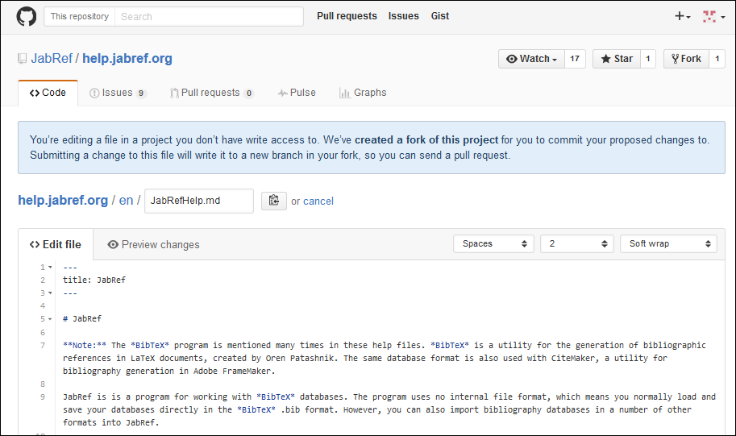
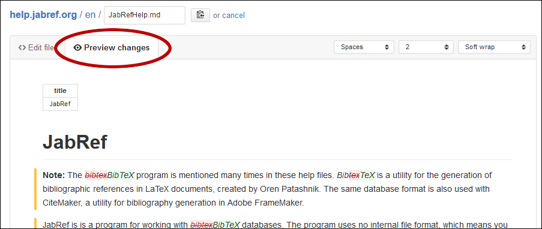
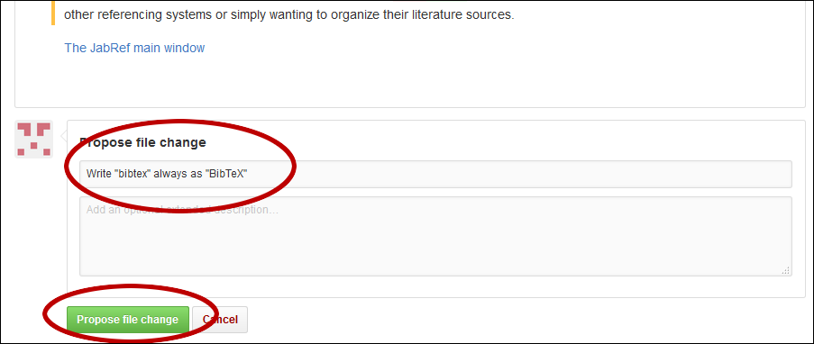
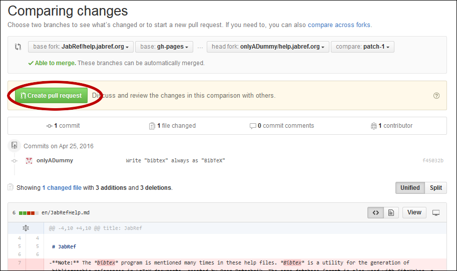
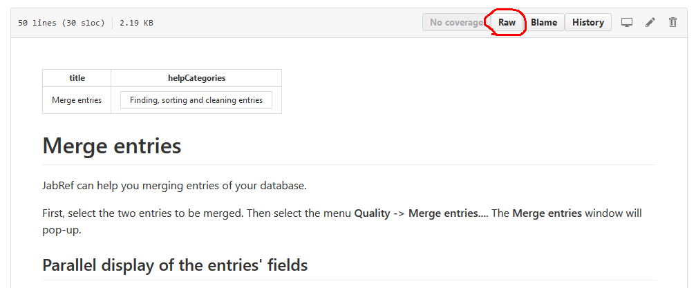
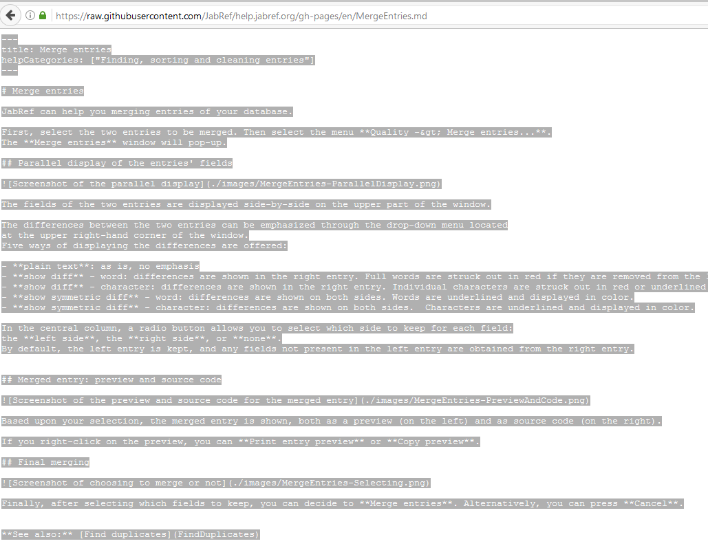

# Contributing to the JabRef Help

You want to contribute to help.jabref.org? Great! 

Here is a quick start guide:

## Prerequisite

Our help pages are hosted at [GitHub](https://www.github.com) which provides version control based on [git](https://git-scm.com/). In order to edit or create a JabRef help page you need a GitHub account. You can sign up [here](https://github.com/join) for free.

If you already have an account, please make sure that you are signed in.

## Editing Help Pages directly in the browser

The easiest way to fix small errors or to add additional information is to edit a JabRef help page directly in your browser:

### Start editing

At the bottom of each help page you can find a link "Edit Page":

Just click here to show the source of the page.

This leads you to GitHub:

To actually edit the page click on the pencil icon which is highlighted above.

### Make your changes

The window to edit the page at GitHub looks like this:

Most text can be simply added in this field as plain text. 
However, you can style your contribution by using [markdown](https://daringfireball.net/projects/markdown/). Markdown is a rather easy way to format text without the need for complex markup as for example in HTML.

You can find an introduction to markdown [here](https://daringfireball.net/projects/markdown/) or [here](https://guides.github.com/features/mastering-markdown/).

In order to check your changes hit the "Preview Changes" tab:

### Saving the changes

To save the changes you have to create a so called "Commit" by scrolling down and hitting the button "Propose File Change":

*Please note: The message you provide here will be visible in the history of the help page, so please think a second to provide a meaningful description of your changes.*

As a last step you have to submit the changes you have made back to us:

Just hit the button "Create Pull Request" and confirm the creation on the next page which is opened by hitting "Create Pull Request".

That's it! We'll review your changes and publish them at [help.jabref.org](http://help.jabref.org).

## Advanced editing

To edit more than one file at a time, to add screenshots and for other more advanced changes we recommend to checkout this repository locally and to create a PR of your changes using the standard git and GitHub workflow.

### Tables

The best way to enter tables is to use this [Table generator](http://www.tablesgenerator.com/markdown_tables) for Markdown.
It has the nice feature to generate markdown tables from different sources, e.g. you can directly copy the table from a spreadsheet or upload a csv files. Just copy and paste the generated markdown.

## Note when translating pages

 - Categories must not be translated (they are only needed in the English pages and are ignored in all other languages).
 - If the title in the yaml frontmatter (this is at the beginning at each page surrounded by `---`) starts with a special character (eg. `*`), the whole title must be surrounded by quotation marks (`"`).
 - You cannot enclose text with `{{ ... }}` as this will get interpreted as Liquid syntax and not displayed as is. Use `{ { ... } }` instead (with spaces between the braces).

### Fetch the English version

1. View the page you want to translate in raw. For instance, navigate to https://github.com/JabRef/help.jabref.org/blob/gh-pages/en/MergeEntries.md and click on RAW.
  

2. Copy all the text. (<kbd>Ctrl</kbd> + <kbd>A</kbd>, <kbd>Ctrl</kbd> + <kbd>C</kbd>)
  

3. Navigate to the version in the target language. For instance, https://github.com/JabRef/help.jabref.org/blob/gh-pages/ja/MergeEntries.md

4. Click on the pencil icon
  

5. Replace text with the one of the clipboard
  - Click into the text area
  - <kbd>Ctrl</kbd> + <kbd>A</kbd>
  - <kbd>Ctrl</kbd> + <kbd>V</kbd>

6. Remove the "category"
  The category is translated in [localization_ja.json](https://github.com/JabRef/help.jabref.org/blob/gh-pages/ja/localization_ja.json) and thus does not need to be kept there.
  

7. Translate

8. Save your changes
  See [Saving the changes](#saving-the-changes)

9. Upload images
  In case you want to upload images, navigate to the "images" subfolder and press "Upload images"
  

## Adding a new language

Example: Italian (it)

1. Create `it` folder
2. Create `it/localization_it.json` (copy `en/localization_en.json` and delete/translate the values)
3. Run `python _scripts/automate.py update`
4. Add the Italian index to the main index if some of the pages are translated into Italian
