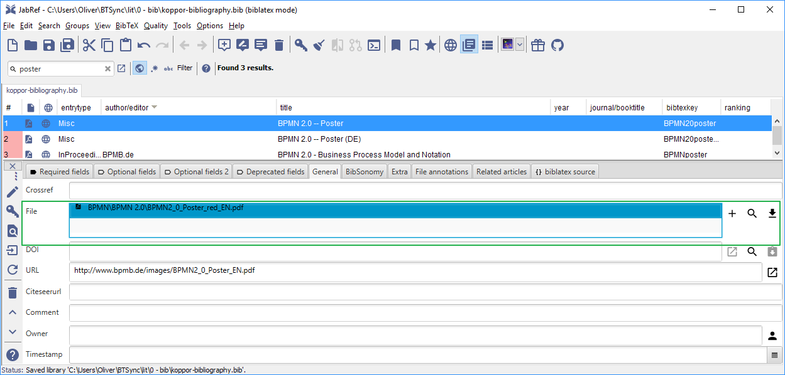
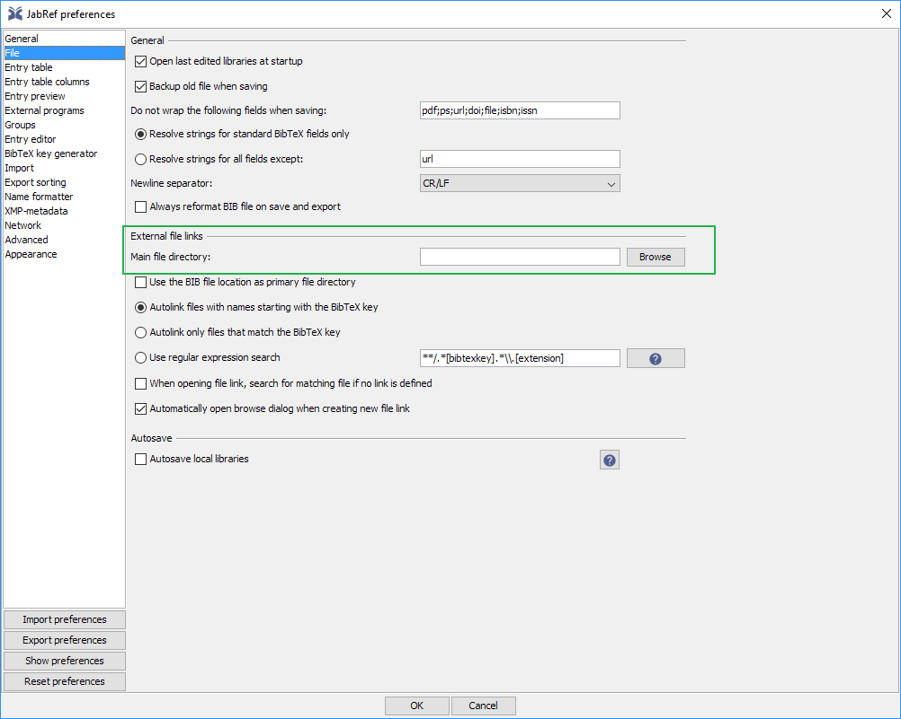
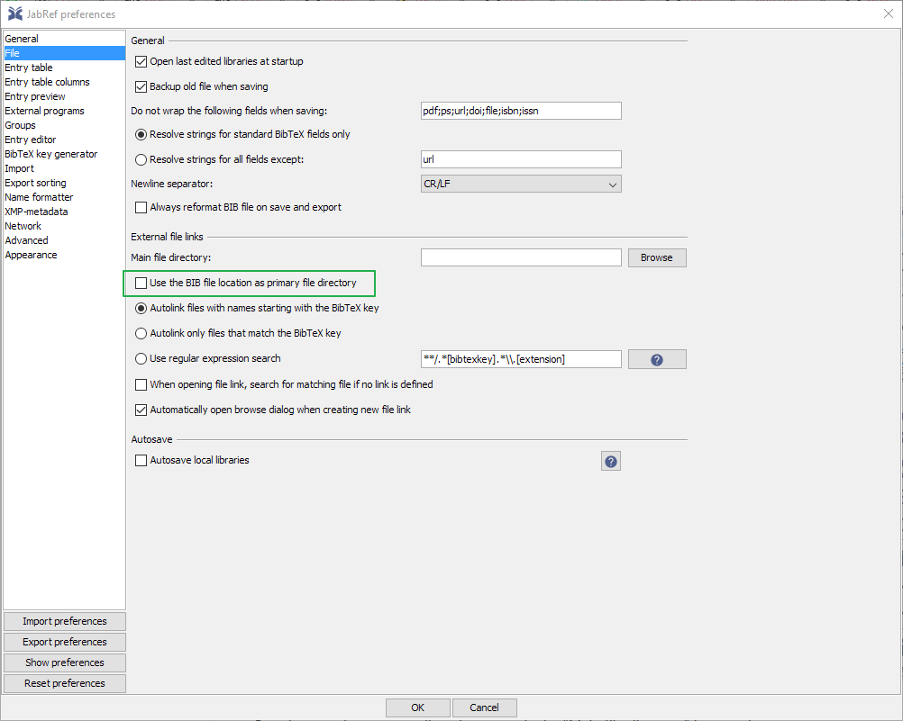
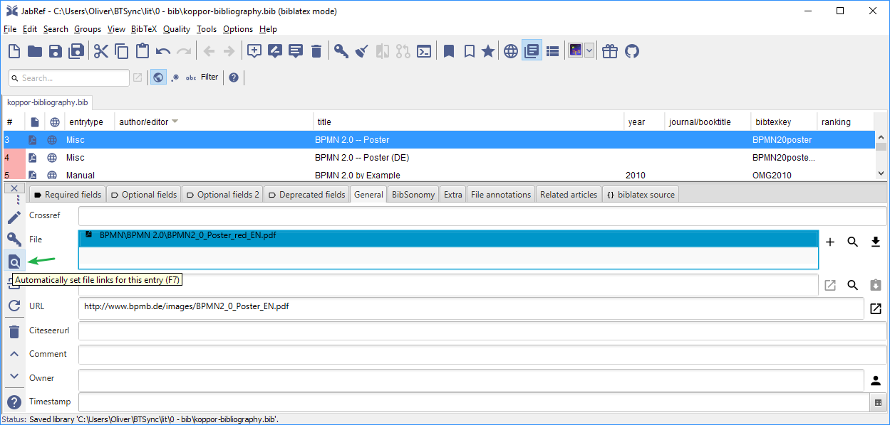
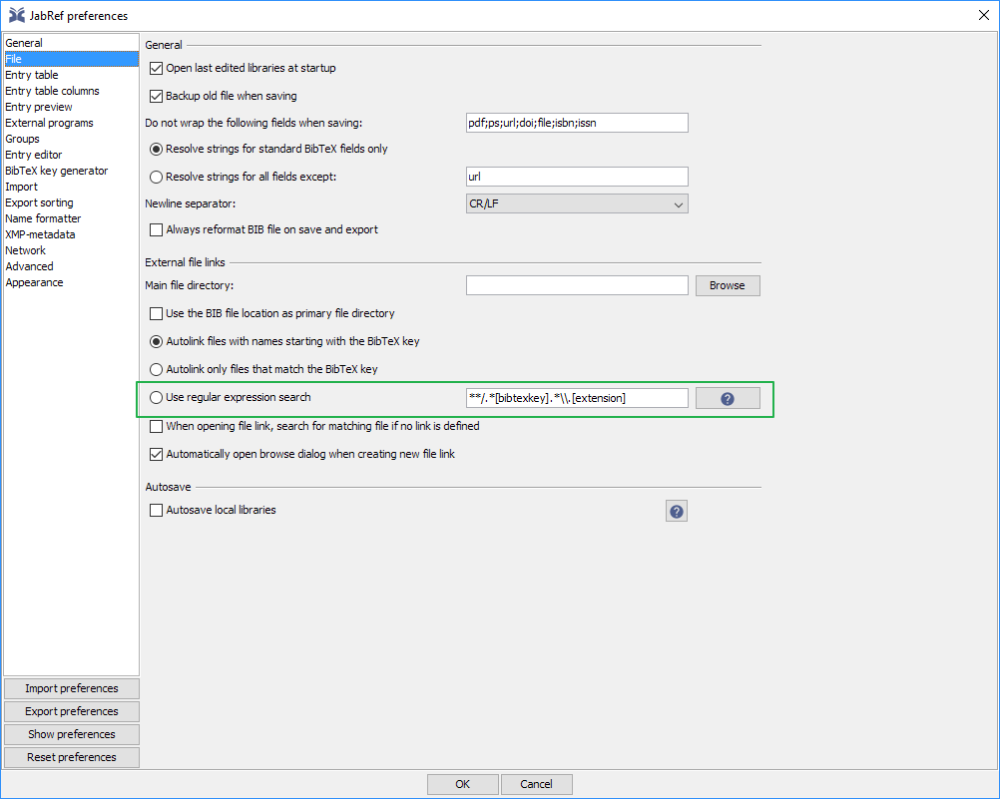
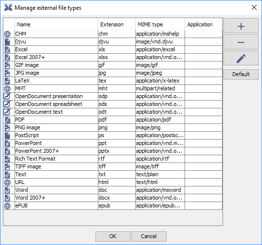

# File links in JabRef

JabRef lets you link up your entries with files of any type stored on your system.
Thereby, it uses the field `file`, which contains a list of linked files.
Each entry can have an arbitrary number of file links, and each linked file can be opened quickly from JabRef.
The fields `url` and `doi` are used as links to documents on the web in the form of an URL or a DOI identifier respectively.
See [External Files](ExternalFiles) for an explanation.

In BibTeX terms, the file links are stored as text in the field `file`.
From within JabRef, however, they appear as an editable list of links accessed from the entry editor along with other BibTeX fields.

## Table of contents

<!-- toc -->

- [Adding external links to an entry](#adding-external-links-to-an-entry)
- [Directories for files](#directories-for-files)
- [Auto linking files](#auto-linking-files)
  * [Using Regular Expression Search for Auto-Linking](#using-regular-expression-search-for-auto-linking)
- [Opening external files](#opening-external-files)
- [Setting up external file types](#setting-up-external-file-types)

<!-- tocstop -->

## Adding external links to an entry

If the "file" field is included in [General fields](GeneralFields), you can edit the list of external links for an entry in the [Entry editor](EntryEditor).
The editor includes buttons for inserting, editing and removing links, as well as buttons for reordering the list of links.

## Directories for files

JabRef offers following directories:

1. Options → Preferences → File → External file links → Main file directory
   
2. File → Library properties → General file directory
3. File → Library properties → User-specific file directory
   

One of thes settings is required.
Mostly the "Main file directory" is enough.
When sharing a library across multiple persons, each user might have a different directory.
Either each user can set his directory in the "Main file directory".
In case the group also shares papers and thus there are two directories (the private one and a group-shared one), one can set a directory within the library (the "General file directory").
In case a user has a different location of the shared folder (e.g., different paths on Linux and Windows), he can use the "User-specific file directory".
This settings is persisted in the `bib` file in a way that it does not overwrite the setting of another user.
For this, JabRef uses the username of the currently logged in user.
So, both `mary` and `aileen` can set a different user-specific file directory.

In some settings, the bib file is stored in **the same directory** as the PDF files.
Then, one ignore all the above directories and enable "use the BIB file location as primary file directory".
In this case, JabRef starts searching for PDF files in the directory of the `bib` file.

.

Relative file directories obviously only work in the library properties fo a bib file, e.g. `a.bib` → Library properties → General file directory → `papers`.
Assume to have two bib files: `a.bib` and `b.bib` located in different directories:
`a.bib` located at `C:\a.bib` and `b.bib` located at `X:\b.bib`.
When I click on the `+` icon in the general Tab of file `a.bib`, the popup is opened in the directory `C:\papers` (assuming `C:\papers` exists).

## Auto linking files

If you have a file within or below one of your file directories with an extension matching one of the defined external file types, and a name containing a BibTeX entry's BibTeX key, the file can be autolinked by clicking on the **Auto** button in the entry editor.

The rules for which file names can be autolinked to a BibTeX key can be set up in **Preferences → File → External file links → Use regular expression search**.

If you want to download a file and link to it from a BibTeX entry, you can do this by clicking the **Download** button in the entry editor.

A dialog box will appear, prompting you to enter the URL.
The file will be downloaded to your main file directory, named based on the entry's BibTeX key, and finally linked from the entry.

JabRef uses all directories set at [Directories for files](#directories-for-files) to search for the files.
JabRef starts in the user-specific file directory, then the general file directory and finally the main file directory to handle files.

### <a href="" id="RegularExpressionSearch">Using Regular Expression Search for Auto-Linking</a>

It is possible to have greater flexibility in the naming scheme by using regular expression for the search.
In most cases it should not be necessary though to adapt the given default.

If you open the external preferences (Options → Preferences → File) you will find an option called "Use regular expression search".
Checking this option will allow you to enter your own regular expression for search in the PDF directories.

The following syntax is understood:

-   `*` - Search in all immediate all subdirectories excluding the current and any deeper subdirectories.
-   `**` - Search in all subdirectories recursively AND the current directory.
-   `.` and `..` - The current directory and the parent directory.
-   `[title]` - All expressions in square brackets are replace by the corresponding field in the current entry
-   `[extension]` - Is replaced by the file-extension of the field you are using.
-   All other text is interpreted as a regular expression. But caution: You need to escape backslashes by putting two backslashes after each other to not confuse them with the path-separator.

The default for searches is `**/.*[bibtexkey].*\\.[extension]`.
As you can see this will search in all subdirectories of the extension-based directory (for instance in the PDF directory) for any file that has the correct extension and contains the BibTeX-key somewhere.

## Opening external files

There are several ways to open an external file or web page.
In the entry table, you can click on the PDF icon to open the PDF.
In case there are multiple PDFs linked, always the first one is opened.
You can also right click on the line of the entry in the entry table and select "Open file".
There is also a keyboard shorcut for this:
In the default setting, this is <kbd>F4</kbd>, but [it can also be customized](CustomKeyBindings).

To access any of an entry's links, click on the icon with the right mouse button (or <kbd>Ctrl</kbd> + <kbd>Click</kbd> on Mac OS X) to bring up a menu showing all links.

## Setting up external file types

In general, there is no need to change the settings of external file types.
So, this setting is for advanced users.

For each file link, a file type must be chosen, to determine what icon should be used and what application should be called to open the file.
The list of file types can be viewed and edited by choosing **Options → Manage external file types**, or by clicking the **Manage external file types** button in the **External programs** tab of the Preferences dialog.

A file type is specified by its name, a graphical icon, a file extension and an application to view the files. On Windows, the name of the application can be omitted in order to use Window's default viewer instead.

