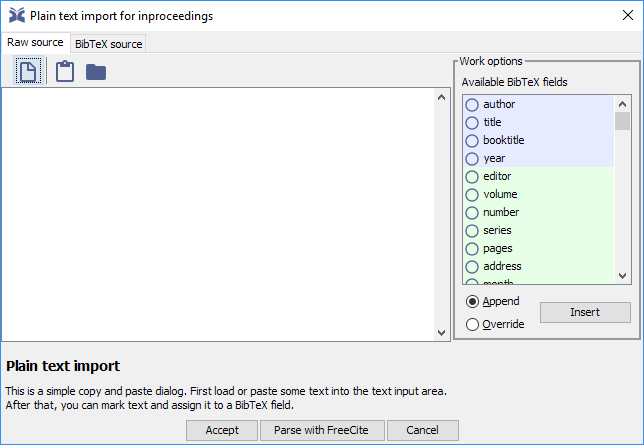
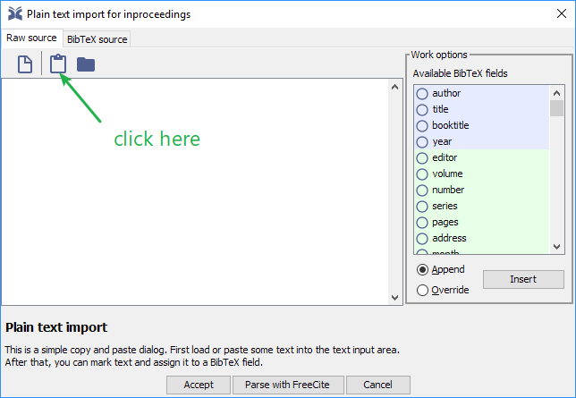
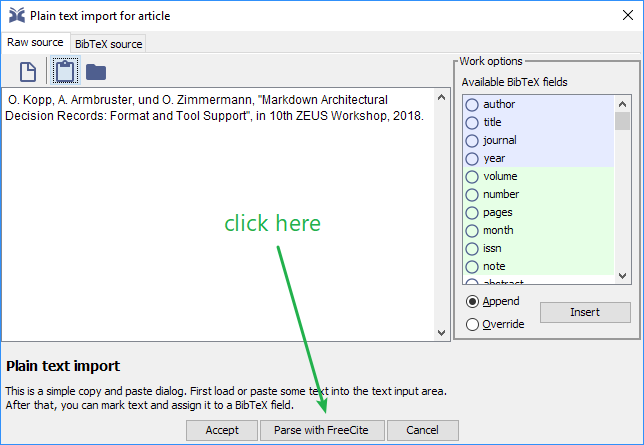
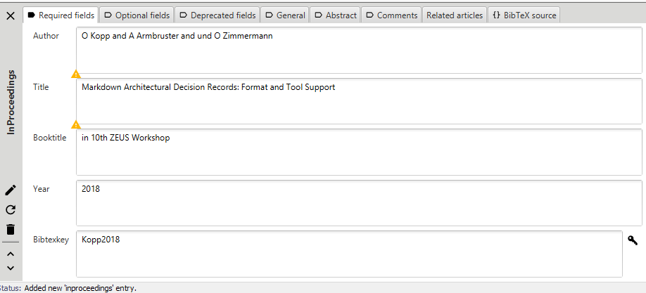
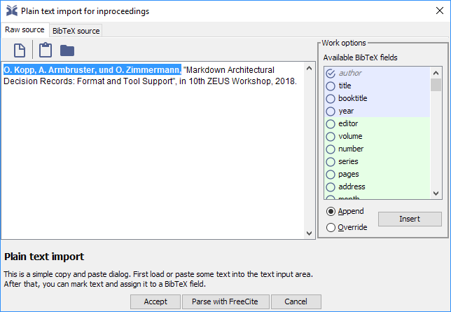

# New entry from plain text

> Entries can be created from a reference text.

In case you have a reference string, JabRef offers the functionality to convert the text to BibTeX.

Example:

    O. Kopp, A. Armbruster, und O. Zimmermann, "Markdown Architectural Decision Records: Format and Tool Support", in 10th ZEUS Workshop, 2018.

1. Click BibTeX and select ""New entry from plain text..." Alternatively, you can press <kbd>Ctrl</kbd>+<kbd>Shift</kbd>+<kbd>N</kbd>.

    

2. Select an entry type.
   Select "InProceedings", this works in the most cases

    

3. The "Plain text import" window opens

    

4. Paste the entry using the middle button "paste"

    

5. Click on "Parse with FreeCite"

    

6. The entry editor opens with the parsed result:

    

    Do your corrections there.

## Manual way

After step 4 from above, you can manually assign the types to each text.

- Select the text
- Double click on the type at the right side at "Available BibTeX fields"

After you finished, you can press "Accept".
