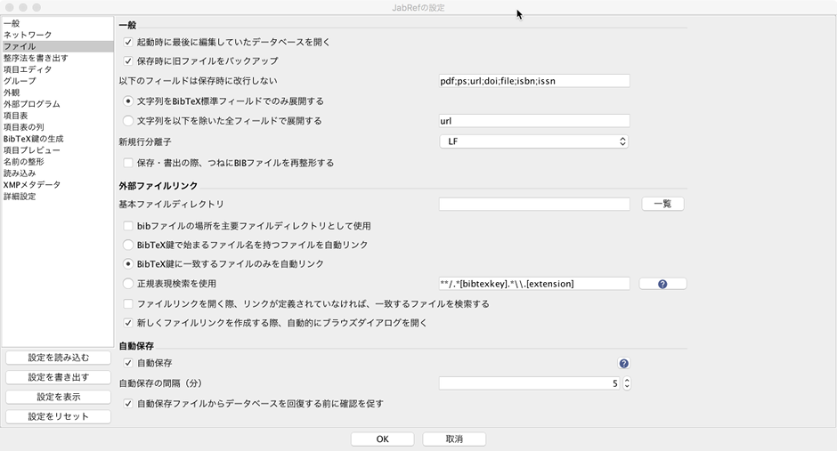

# 自動保存

## 目的

自動保存機能は，お使いのコンピューターやJabRefがクラッシュした場合に，データが失われることを回避するのに役立ちます．

## 設定

自動保存機能は，**オプション → 設定** で出てくるウィンドウの左パネルで **ファイル** を選択することで，自動機能を有効にし，かつ設定することができます．ウィンドウ下部に，**自動保存** というセクションがあります．

まず，自動保存を有効にするか否かを選択することができます（前者推奨）．それから，２つの自動保存の間の遅延時間を選択することができます．最後に，JabRefが自動保存ファイルを使用しようとするときに，通知するように設定することができます（これによって何かがおかしくなったことを知ることができます）．

## 機能

自動保存が有効になっている場合には，JabRefは，最後に保存されてからお使いのデータベースが変更されたかどうかを，定期的に(間隔は設定可能)点検します．各データベースについて，JabRefはそのコピーを`.$[ファイル]$`という名称のファイルに保存します．ここで`[ファイル]`は該当するデータベースのファイル名です．自動保存ファイルは，bibファイルと同じディレクトリに作られます．

自動保存ファイルは，能動的にデータベースを保存したときやJabRefを正常に終了したときには削除されます．しかしながら，JabRefがクラッシュによって終了した場合には，自動保存ファイルは残されたままになります．この場合には，次にデータベースを開こうとした際に自動保存ファイルが検出され，データベースを自動保存ファイルから回復するかどうか尋ねられます．

自動保存は，既定では有効にされており，5分ごとに保存されます．望むならば，自動保存を使用する前に尋ねるオプションを無効にすることができます．この場合には，JabRefは，通知することなく静かにデータベースを回復します．
